# Apache Kafka
---

O **Apache Kafka** é uma plataforma distribuída open-source de **streaming de eventos** que é utilizada por milhares de empresas para uma alta performance em pipe line de dados, stream de analytics, integração de dados e aplicações de missão crítica.

https://kafka.apache.org

### O Mundo dos eventos
A cada dia que passa precisamos processar mais e mais eventos em diversos tipos de plataforma. Desde sistemas que precisam se comunicar, devices para IOT, monitoramento de aplicações, sistemas de alarmes, etc.

Perguntas:
- Onde salvar esses eventos?
- Como recuperar de forma rápida e simples, fazendo com que o feedback entre um processo e outro, ou mesmo entre um sistema e outro possa acontecer de maneira fluida e em tempo real?
- Como escalar?
- Como ter resiliência e alta disponibilidade?

### Kafka e seus super poderes!
- Altíssimo throughput. (Aguenta pancada)
- Latência extremamente baixa (2ms)
- Escalável
- Armazenamento
- Alta disponibilidade
- Se conecta com quase tudo
- Bibliotecas prontas para as mais diversas tecnologias
- Ferramenta open-source

### Empresas usando Kafka
- Linkedin
- Netflix
- Uber
- Twitter
- Dropbox
- Spotify
- Paypal
- Bancos...

### Conceitos e dinâmica básica de funcionamento
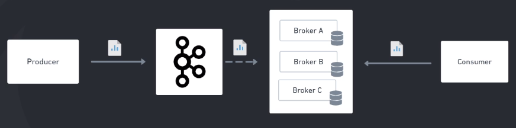

- Kafka é um cluster (conjunto de maquinas), e esse cluster é formado de nós, e esses nós são chamados de Broker.
- Cada broker é uma máquina com banco de dados próprio.
- Producer: Enviar mensagem para o Kafka
- Consumer: Acessa o Kafka para ler a mensagem
- A recomendação para a utilização do kafka é de no minimo 3 Brokers

### Tópicos
É o canal de comunicação responsável por receber e disponibilizar os dados enviados para o Kafka.
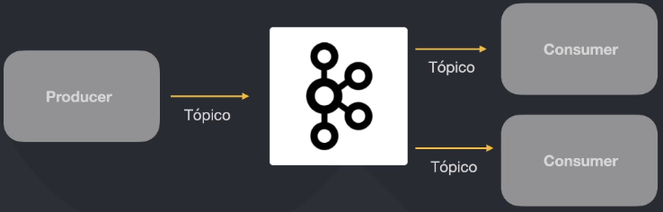

### Tópico ~= Log
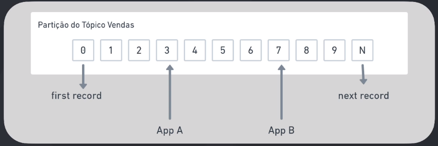

### Anatomia de um registro
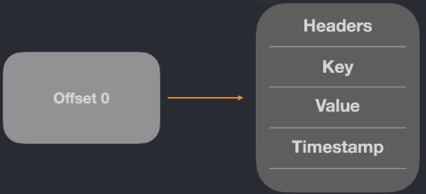

### Partições
Cada tópico pode ter uma ou mais partições para conseguir garantir a distribuição e resiliência de seus dados.
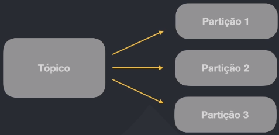

### Sobre as "Keys"
##### Garantindo ordem de entrega
- Só é possivel garantir a ordem dentro da mesma partição

Risco: Existe uma grande chace de o Estorno ser executado antes da efetivação da transferencia, pelo fato do consumirdor 1 estar lento; Isso é um problema.
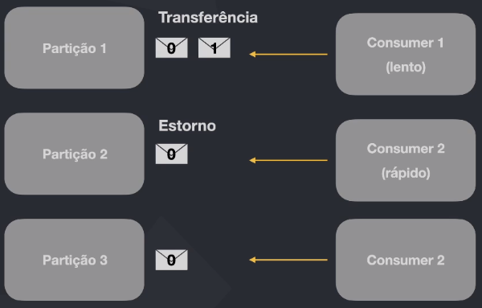

**Transferencia e estorno precisam estar na mesma partição**, e podemos garantir isso através das "Keys"


### Partições distribuidas

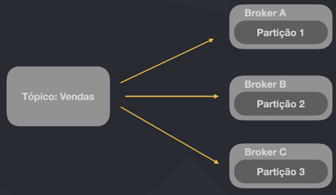

**Replication Factor**
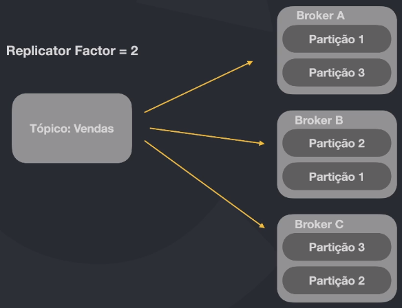

### Partition Lidership - Partições Liderança
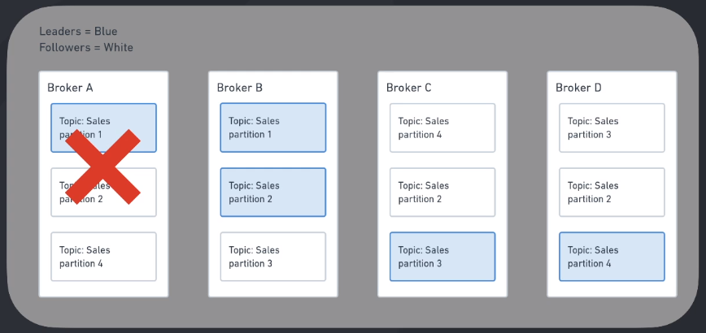

### Producer: Garantia de entrega

A mensagem é enviada ao Leader sem a necessidade de confirmação
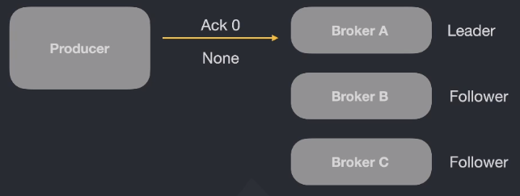

A mensagem é enviada e o Producer aguarda a confirmação do Leader
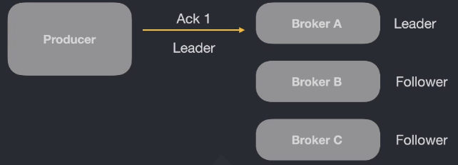

A mensagem é enviada e o Producer aguarda a confirmação e duplicação para os Followers ser realizada pelo Leader
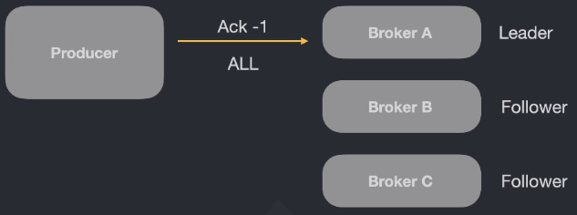

##### Performance VS Garantia
**At most once:** Melhor performance. Pode perder algumas mensagens


**At least once:** Performance moderada. Pode duplicar mensagens


**Exacly once:** Pior performance. Exatamente uma vez
1,2,3,4,5 -> [Kafka Process] -> 1,2,3,4,5


### Producer: Indepotência
Producer Indepotente **OFF** : Mensagem duplicada
Producer Indepotente **ON** : Descarta mensagem duplicada
É um recurso que gera lentidão mas garante que não havera duplicidade
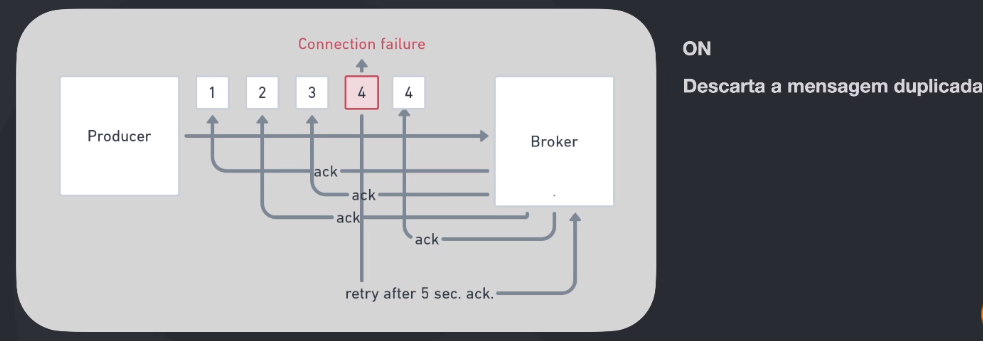

### Consumer e Consumer Group

Grupo com 2 consumers lendo 3 partições.
Um consumer irá ler 2 partições
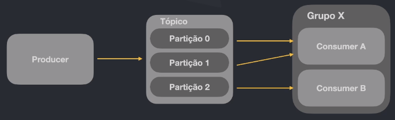

Grupo com 3 consumers lendo 3 partições, cada um lê uma partição
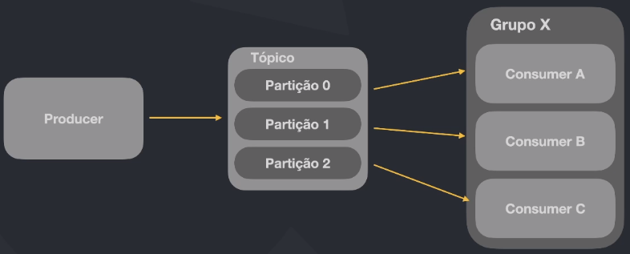

Grupo com 4 consumers lendo 3 partições.
Um consumer irá ler ficar parado, sem ler nenhuma partição.
**Se existir apenas 1 consumer no grupo ele iá ler todas as partições**
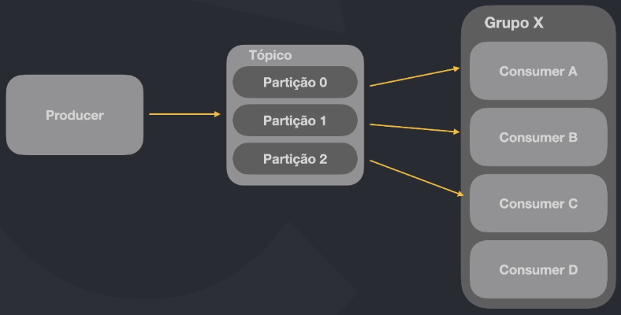


Docker Compose:
- Zookeeper
- Kafka
- Control Center Confluent

### Consumindo e produzindo mensagens

Create a new topic
``` bash
kafka-topics --create --topic=teste --bootstrap-server=localhost:9092 --partitions=3
kafka-topics --list --bootstrap-server=localhost:9092
```
``` bash
#Detalhamento do topic
kafka-topics --bootstrap-server=localhost:9092 --topic=teste --describe
Topic: teste    TopicId: PWQDtuVVSk2sfriWQYRZmg PartitionCount: 3       ReplicationFactor: 1    Configs: 
        Topic: teste    Partition: 0    Leader: 1       Replicas: 1     Isr: 1
        Topic: teste    Partition: 1    Leader: 1       Replicas: 1     Isr: 1
        Topic: teste    Partition: 2    Leader: 1       Replicas: 1     Isr: 1
```

``` bash
#start consumer
kafka-console-consumer --bootstrap-server=localhost:9092 --topic=teste

#producer a message
kafka-console-producer --bootstrap-server=localhost:9092 --topic=teste

#--from-beginning
kafka-console-consumer --bootstrap-server=localhost:9092 --topic=teste --from-beginning
```

### Introdução aos consumers groups

Executando 2 consumers
``` bash
kafka-console-consumer --bootstrap-server=localhost:9092 --topic=teste

kafka-console-consumer --bootstrap-server=localhost:9092 --topic=teste
```

Consumidores totalmente independentes consomem a mesma mensagem
**Resolvendo esse problema com Groups**
``` bash
kafka-console-consumer --bootstrap-server=localhost:9092 --topic=teste --group=x

kafka-console-consumer --bootstrap-server=localhost:9092 --topic=teste --group=x
```

### Por dentro de um consumer group
``` bash
kafka-consumer-groups --bootstrap-server=localhost:9092 --group=x --describe
#GROUP           TOPIC           PARTITION  CURRENT-OFFSET  LOG-END-OFFSET  LAG             CONSUMER-ID      HOST            CLIENT-ID
# x              teste           0          23              23              0               consumer-x-...47 /172.19.0.3     consumer-x-1
# x              teste           1          29              29              0               consumer-x-...47 /172.19.0.3     consumer-x-1
# x              teste           2          17              17              0               consumer-x-...00 /172.19.0.3     consumer-x-1
```

### Navegando pelo Confluent control center
``` bash
http://localhost:9021/
```


### Golang/Kafka

https://github.com/edenhill/librdkafka
Lib em C como interface para outras linguagens

<br>
<br>

## Kafka Connect
---
"Kafka Connect é um componente gratuito e open-source do Apache Kafka que trabalha como um hub de dados centralizado para integrações simples entre banco de dados, key-value stores, serach indexes e file systems."

https://docs.confluent.io/platform/current/connect/index.html

### Dinâmica
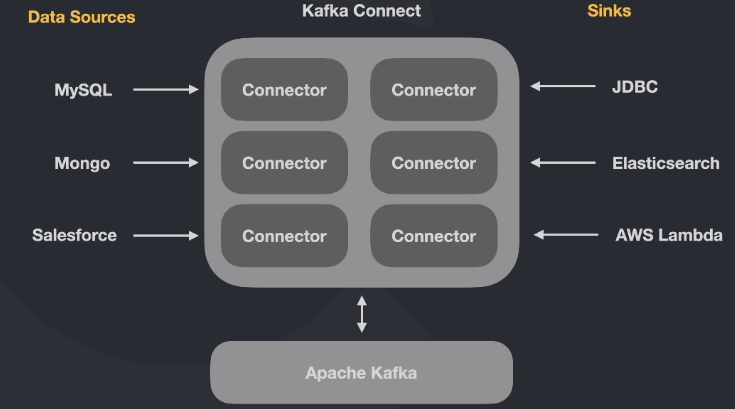


### Standalone Workers
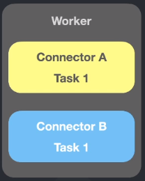

### Distributed Workers
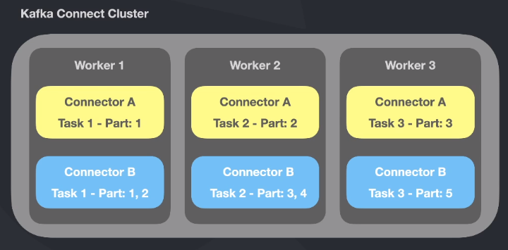

### Converters
As tasks utilizam os "converters" para mudar o firmato dos dados tanto para leitura ou escrita no Kafka.
- Avro
- Protobuf
- JsonSchema
- Json
- String

### DLQ - Dead Letter Queue
Quando há um registro inválido, independente da razão, o erro pode ser tratado nas configurações do conector através da propriedade "errors.tolerance". Esse tipo de configuração pode ser realizado apenas para conectores do tipo "Sink".

- none: Faz a tafera falhar imediatamente.
- all: Erros são ignorados e o processo continua normalmente
- errors.deadletterqueue.topic.name = nome-do-topico

### Confluent Hub
https://www.confluent.io/hub/

### Inicializando serviços
[./fc2-kafka-connect/docker-compose.yaml](./fc2-kafka-connect/docker-compose.yaml)
``` bash
docker-compose up -d
```

Kafka Control Center
http://localhost:9021

### Confirurando MySQL
``` bash
docker-compose exec mysql bash

mysql -uroot -p

CREATE TABLE categories(id INT AUTO_INCREMENT PRIMARY KEY, name VARCHAR(255));
```

### Configurando connector do Mysql


### Confluent Cloud